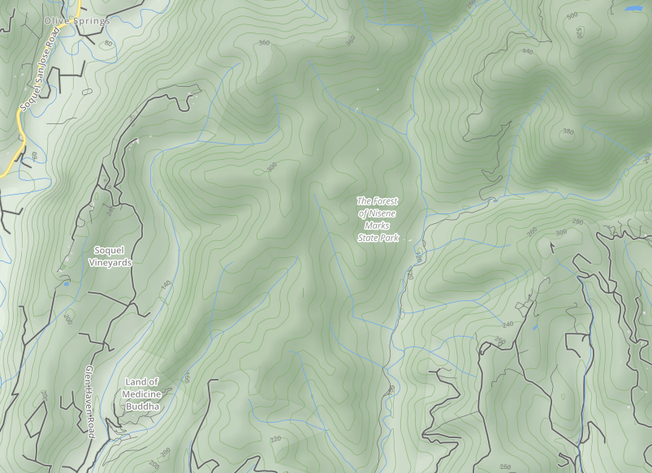

GraniteMaps Base Map
====================

This is a collection of CartoCSS files that can be used to apply a style
to a map using [TileMill](https://github.com/mapbox/tilemill). It is based
off [osm-bright](https://github.com/mapbox/osm-bright), with elevation data
following [this guide](http://stevebennett.me/tag/contours/).

